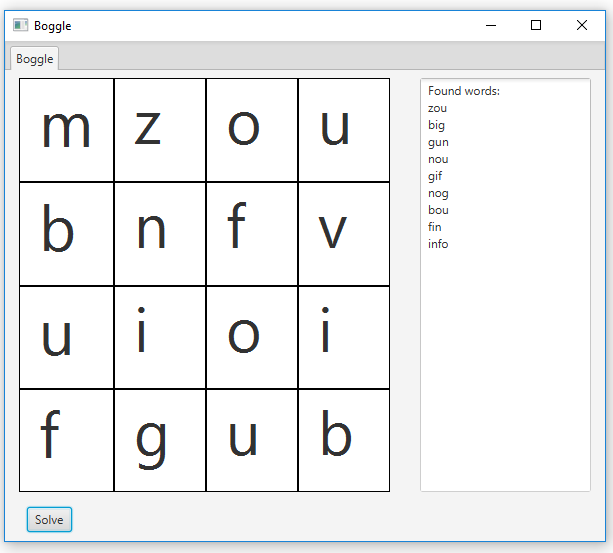

# Boggle Exercise
# This is a project for the Hanze University.
For this exercise we needed to solve a boggle board using a dictionary.  
A default Boggle board has a 4*4 grid. 

# Installation: 
  - Pull the repository
  - Run main

# Todo:  
Due to limited time the algorithm is not optimzed.  
It's working but the solving can be much faster.  
Ideas:
- Implement trie
- When a word like 'add' is not found, stop searching for new combinations that start with 'add' like 'adding'

# Presentation:

